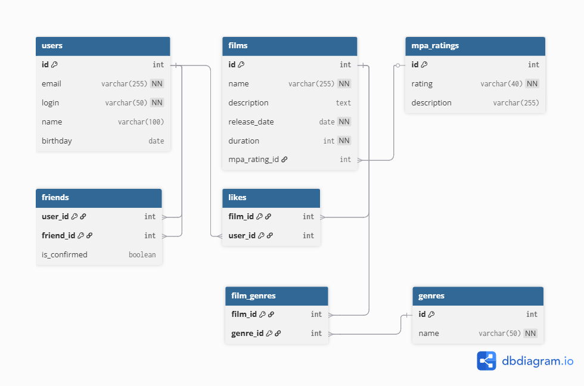

# Проект Filmorate

В этом проекте реализована база данных для хранения информации о фильмах, пользователях, жанрах, рейтингах, дружбе и лайках.

## Диаграмма базы данных

Схема базы данных доступна в файле [schema.png](./schema.png).  



---

## Таблицы

- **users** — Пользователи приложения.
- **films** — Фильмы.
- **genres** — Жанры фильмов.
- **mpa_ratings** — Возрастные рейтинги.
- **film_genres** — Жанры фильмов.
- **friends** — Дружба между пользователями. Дружба является
подтвержденной, если пользователи в друзьях друг у друга.
- **likes** — Лайки пользователей для фильмов.

---

## Примеры основных операций (SELECT)

```sql
-- 1. Получить список всех пользователей.
SELECT *
FROM users;

-- 2. Получить список всех фильмов.
SELECT *
FROM films;

-- 3. Получить список всех жанров.
SELECT *
FROM genres;

-- 4. Получить список фильмов с указанием их жанров.
-- Один фильм может относиться к нескольким жанрам.
SELECT f.name   AS film_name,
       g.name   AS genre_name
FROM films AS f
JOIN film_genres AS fg ON f.id = fg.film_id
JOIN genres AS g ON fg.genre_id = g.id;

-- 5. Получить список фильмов с определённым возрастным рейтингом.
SELECT f.name AS film_name,
       r.name
FROM films AS f
JOIN mpa_ratings AS r ON f.mpa_rating_id = r.id
WHERE r.name = 'PG-13';

-- 6. Получить список друзей пользователя (кого пользователь
-- отметил как друзей).
-- user_id — пользователь, добавивший друга.
-- friend_id — пользователь, добавленный в друзья.
SELECT f.friend_id AS friend_id,
       u.name      AS friend_name
FROM friends f
JOIN users u ON u.id = f.friend_id
WHERE f.user_id = 1;

-- 7. Получить список фильмов с количеством лайков
SELECT f.name               AS film_name,
       COUNT(l.user_id)     AS likes_count
FROM films AS f
LEFT JOIN likes AS l ON f.id = l.film_id
GROUP BY f.id;