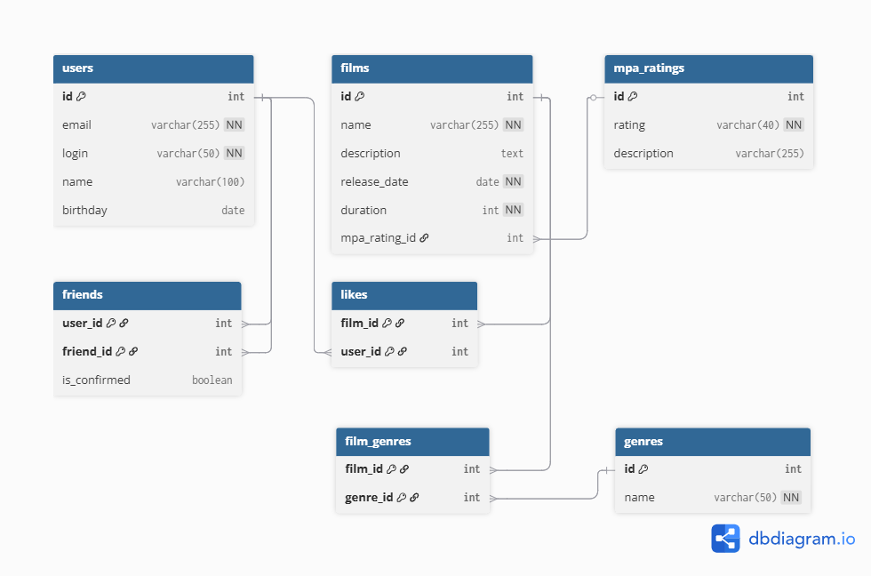

# Проект Filmorate

В этом проекте реализована база данных для хранения информации о фильмах, пользователях, жанрах, рейтингах, дружбе и лайках.

## Диаграмма базы данных

Схема базы данных доступна в файле [schema.png](./schema.png).  



---

## Основные таблицы

- **users** — пользователи приложения.
- **films** — фильмы.
- **genres** — жанры фильмов.
- **mpa_ratings** — возрастные рейтинги.
- **film_genres** — жанры фильмов.
- **friends** — дружба между пользователями.
- **likes** — лайки пользователей для фильмов.

---

## Примеры основных операций (SELECT)

```sql
-- 1. Получить список всех пользователей
SELECT *
FROM users;

-- 2. Получить список всех фильмов
SELECT *
FROM films;

-- 3. Получить список всех жанров
SELECT *
FROM genres;

-- 4. Получить список фильмов с указанием их жанров
-- Один фильм может относиться к нескольким жанрам
SELECT f.name   AS film_name,
       g.name   AS genre_name
FROM films AS f
JOIN film_genres AS fg ON f.id = fg.film_id
JOIN genres AS g ON fg.genre_id = g.id;

-- 5. Получить список фильмов с определённым возрастным рейтингом
SELECT f.name AS film_name,
       r.rating
FROM films AS f
JOIN mpa_ratings AS r ON f.mpa_rating_id = r.id
WHERE r.rating = 'PG-13';

-- 6. Получить список друзей пользователя
-- user_id — пользователь, инициировавший запрос дружбы
-- friend_id — пользователь, получивший запрос
-- is_confirmed показывает, подтверждена ли дружба
SELECT uf.name AS friend_name,
       f.is_confirmed
FROM friends AS f
JOIN users AS u ON f.user_id = u.id
JOIN users AS uf ON f.friend_id = uf.id
WHERE u.id = 1;

-- 7. Получить список фильмов с количеством лайков
SELECT f.name               AS film_name,
       COUNT(l.user_id)     AS likes_count
FROM films AS f
LEFT JOIN likes AS l ON f.id = l.film_id
GROUP BY f.id;